# Tail Trails

The Tail Trails Project, This project is a simple booking system that allows users to make a profile and book dog walks. This project will show the use of CRUD functionality, th euser will be able to create a profile, see (read) the information they currently have in their profile, update their profile should it need to be changed, and delete their profile, they will also be able to request, edit or delete a booking. 

[Click here to go to the live website!](<!--Add Website Link-->) 

 " alt="Live website image"> 

## Table of contents

1. [Wireframes](#wireframes)
    - [Home](#home)
    - [Login](#login)
    - [Sign Up](#sign-up)
    - [Book Walk](#book-walk)
    - [My Walks](#my-walks)
    - [Edit Profile](#edit-profile)
    - [Edit Bookings](#edit-bookings) 
2. [User Stories](#user-stories)
3. [Expectations](#expectations)
    - [First Time Users](#first-time-users)
    - [Returning User](#returning-user)
    - [Admin](#admin)
4. [Features](#features)
    - [Sign Up Page](#sign-up-page)
    - [Sign In Page](#sign-in-page)
    - [Sign Out](#sign-out)
    - [View Availability](#view-availability)
    - [Create Profile](#create-profile)
    - [View Profile](#view-profile)
    - [Update Profile](#update-profile)

## Wireframes

### Home 
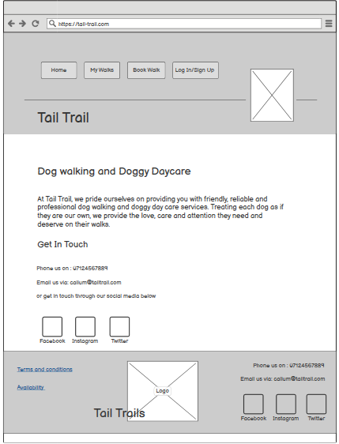
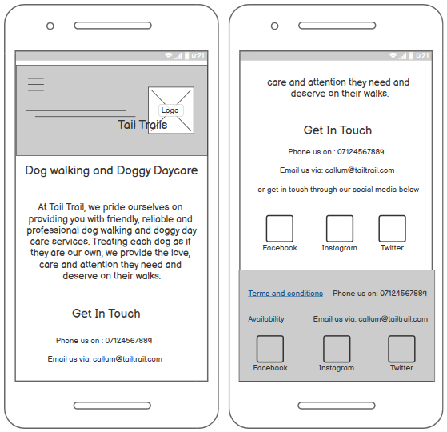

### Login
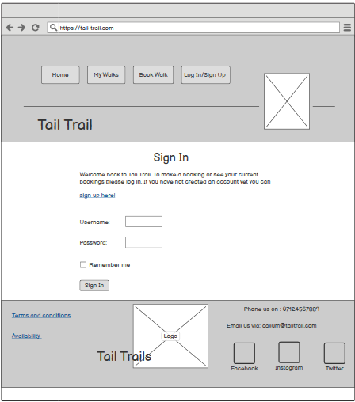
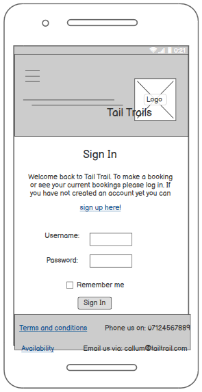

### Sign Up 
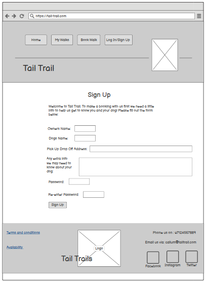
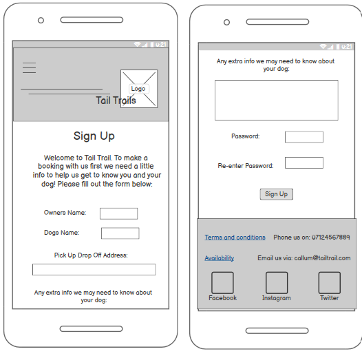

### Book Walk 
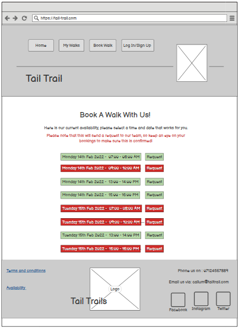
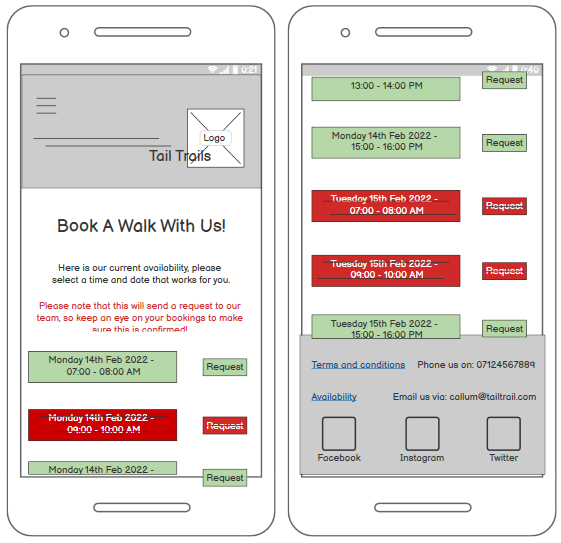

### My Walks 
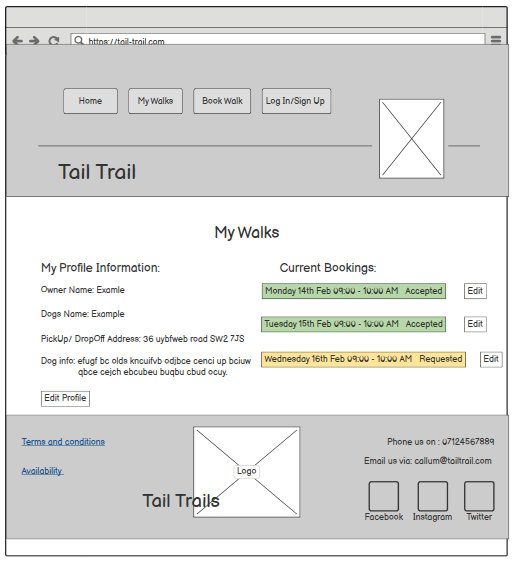
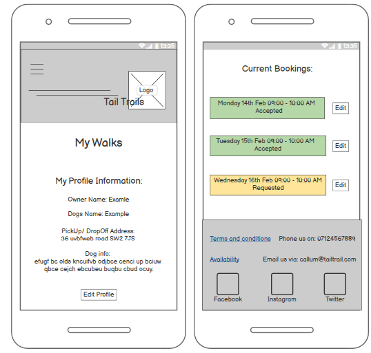

### Edit Profile
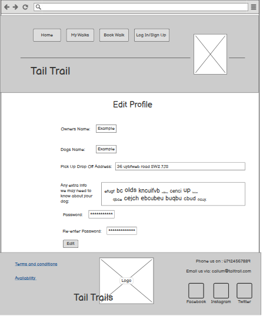
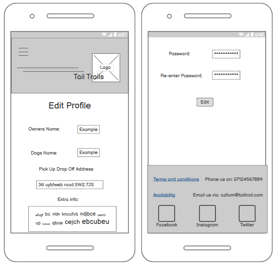

### Edit Bookings
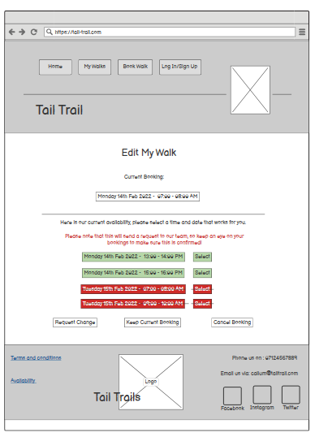
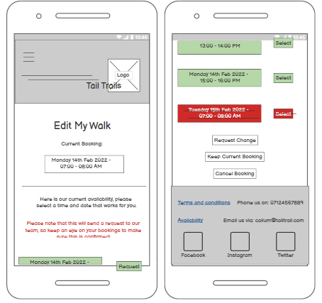

## User Stories

I used Github projects board while working on this project to log my user stories so that I could break the project down into smaller tasks that would be more manageable by moving them into the in progress section whilst I focused on the task and into the done section once completed.

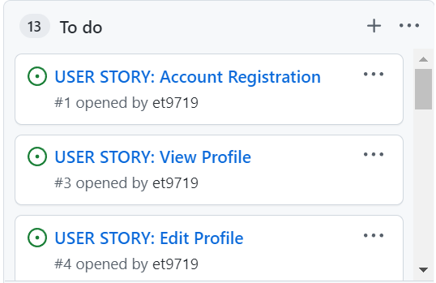

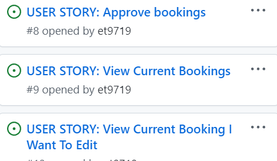
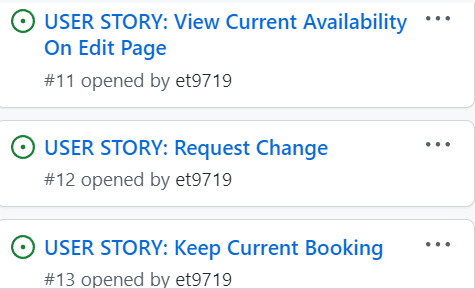
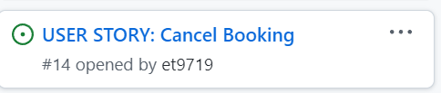

## Expectations

### First Time Users

- I want to be able to see the dates and times that the company offer walks.

- I want to be able to register an account so that I can make bookings through the site.

- I want to be able to create a profile with all the releven information my dog walker would need to know.

- I want to be able to request a booking so that the walkers know I'm interested in making a booking on that day/time.

### Returning User

- I want to be able to view my profile so that I can see my information is correct.

- I want to be able to edit my profile so that if I move address or have new info the walkers may need, I can change this on my profile.

- I want to be able to view my current bookings so that I can see when I have booked a walk for and if it has been approved.

- I want to be able to request to change my booking so that if my plans change I can change my walks too.

- I want to be able to Cancel a booking so that if I no longer need the walk I can let the walkers know.

### Admin

- I want to be able to post availability so that users can see what times are available to make a booking.

- I want to be able to approve bookings so that the customer knows their request is all good to go ahead.

## Features

### Sign Up Page

- The sign up page allows a user to log into the site so they can create a profile and make bookings. 

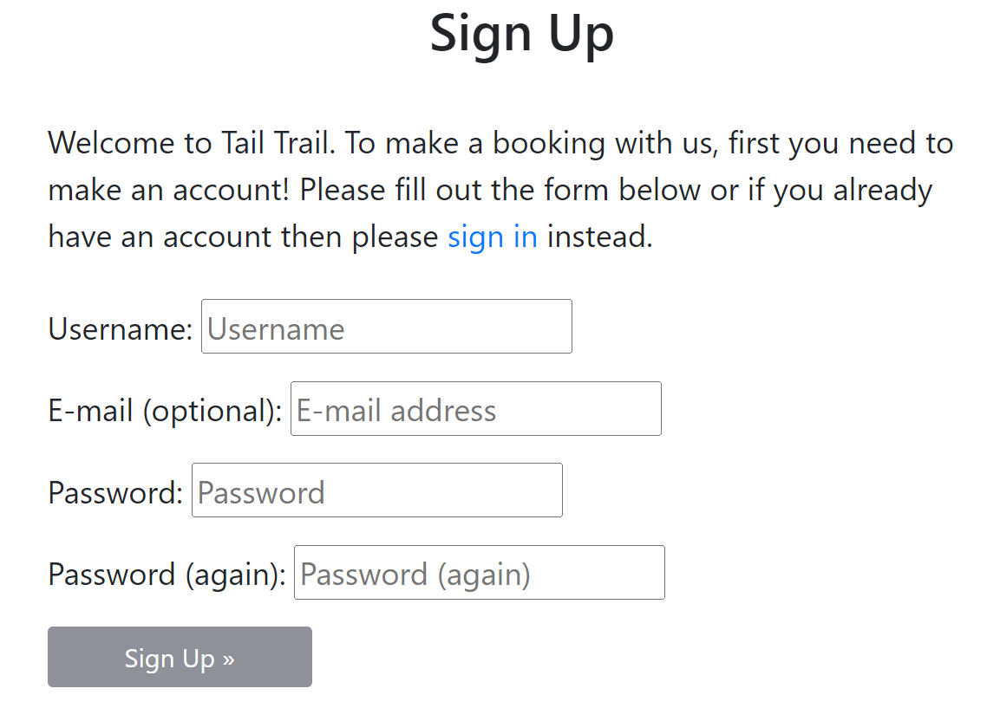

### Sign In Page

- When the user has already registered to the site and wouls like to see their current bookings or make new bookings they can log into there account here.

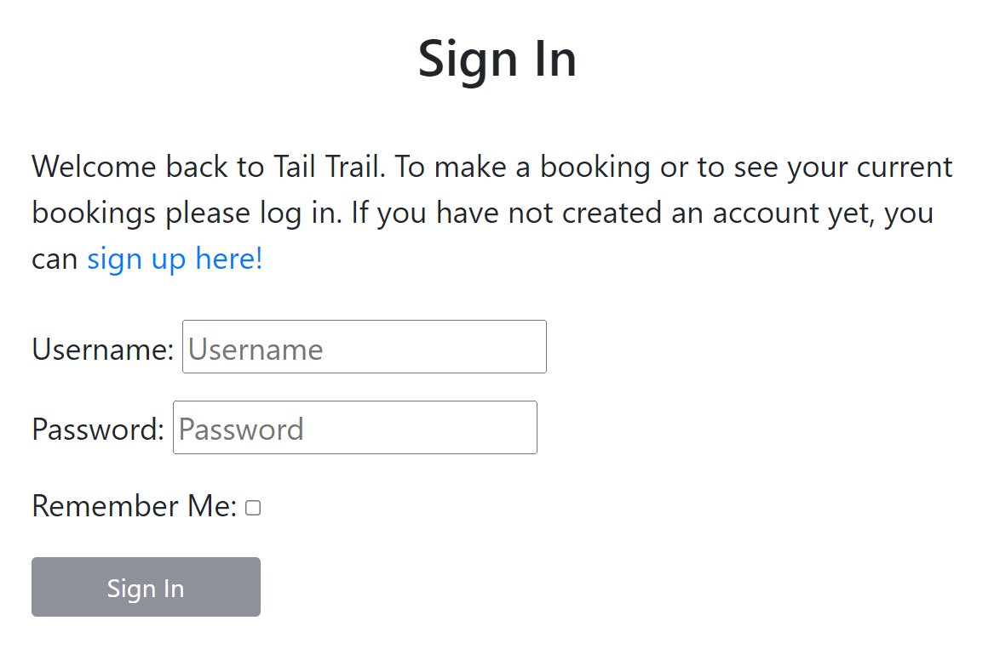

### Sign Out 

- When the user is done they can sign out of there account on this page.

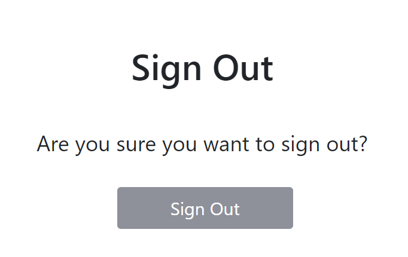

### View Availability 

- When a user is not logged into an account they can still see the availability for walks howvere they will not see a request button as they need to be logged into their account to do this.

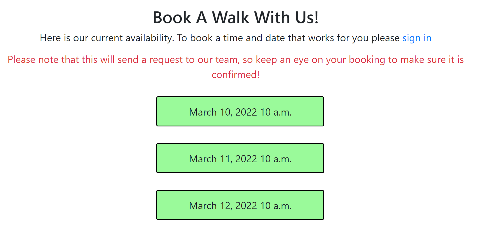
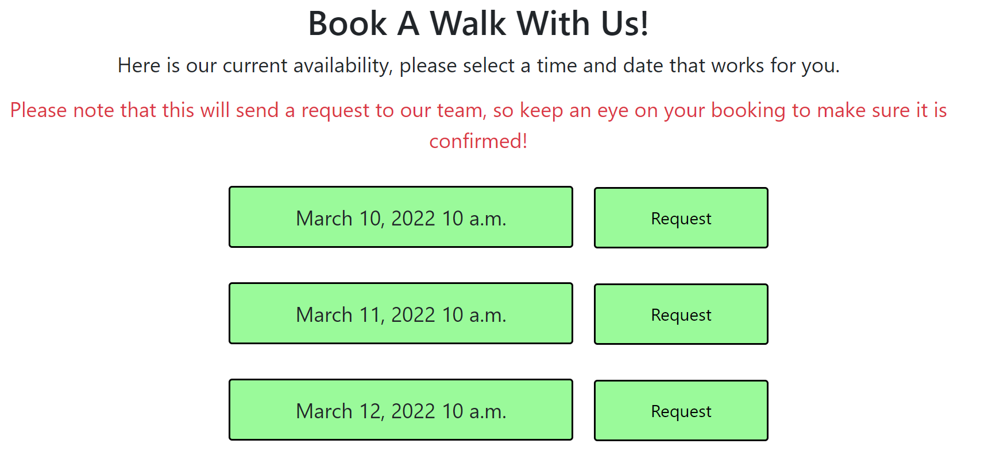

### Create Profile

The user can create a profile by filling in the form on the create profile page.

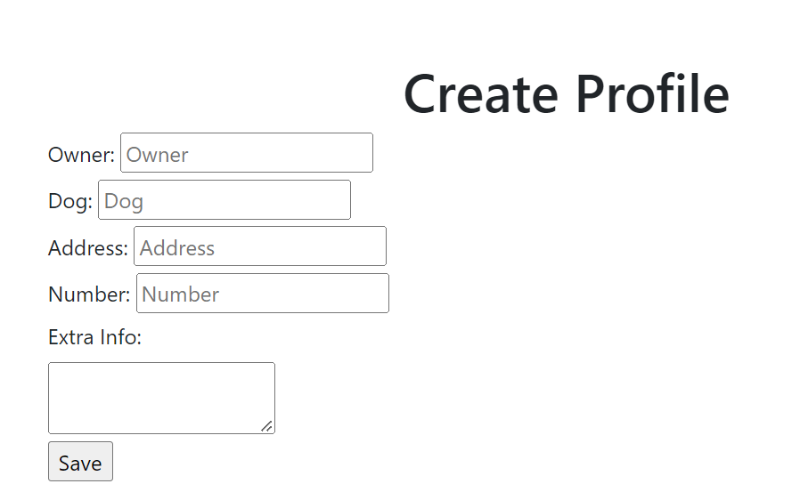

### View Profile

A user will be able to see the information they currently have in their profile on the my walks page.

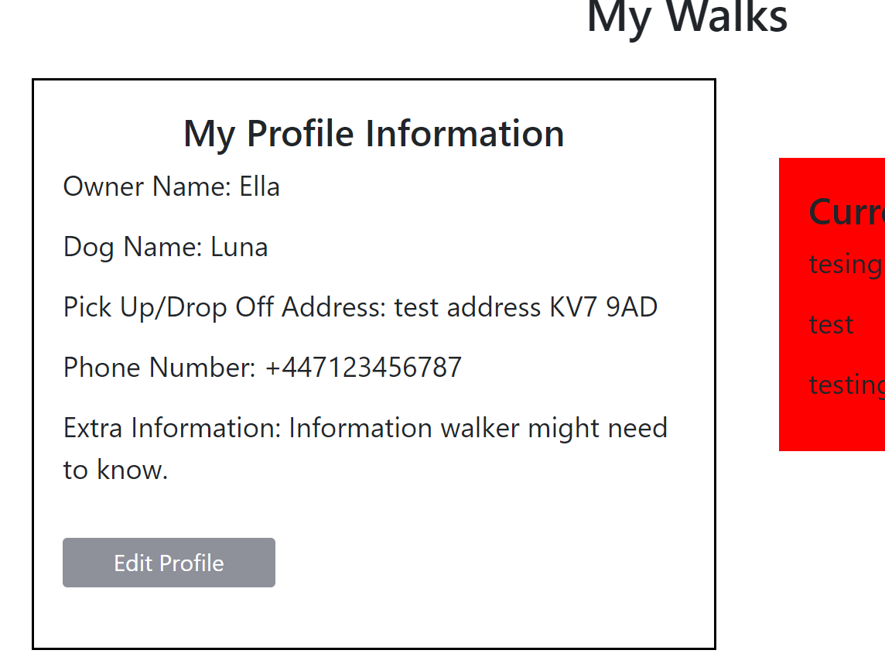

### Update Profile

The user will be able to edit the information they currently have on their profile and change it on the update profile page.

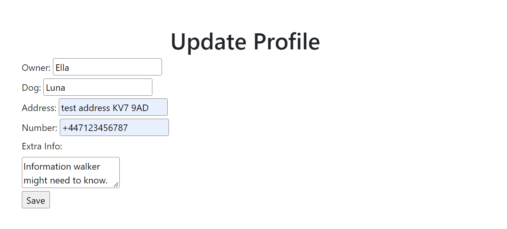

## Testing

### Responsive 

I use Am I Responsive to check if my site is responsive to all devices, I have not yet focused on this as I believe it is more important for me to focus on the functionality of the site first. 

### HTML

[W3C Validator](https://validator.w3.org/) was used to test the HTML for any errors.

### Python 

Python was tested using PEP8 [PEP8 validator](http://pep8online.com/) 