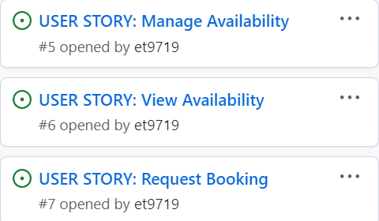

# Tail Trails

<!--Add Website Description-->

[Click here to go to the live website!](<!--Add Website Link-->) 

 " alt="Live website image"> 

## Table of contents

1. [User Stories](#user-stories)
2. [Wireframes](#wireframes)
    - [Home](#home)
    - [Login](#login)
    - [Sign Up](#sign-up)
    - [Book Walk](#book-walk)
    - [My Walks](#my-walks)
    - [Edit Profile](#edit-profile)
    - [Edit Bookings](#edit-bookings)

## User Stories

## Wireframes

### Home 

### Login

### Sign Up 

### Book Walk 

### My Walks 

### Edit Profile

### Edit Bookings

